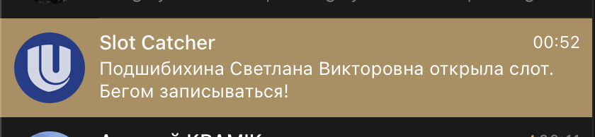

# unn_slot_catcher

Уведомляет об открытом слоте у выбранного психолога на https://psys.unn.ru/login



## Гайд по установке
1. git clone на свое устройство
2. создаем .env файл на примере dotenv_example.txt
3. скачиваем google chrome 
4. проверяем версию chrome
```bash
# google-chrome --version
Google Chrome 123.0.6312.86
```
5. скачиваем webdriver под свою версию <a href='https://googlechromelabs.github.io/chrome-for-testing/'>тут</a>
6. кладем chromedriver из скачанного архива в папку drivers
7. создаем .venv и активируем
8. устанавливаем зависимости
```python3
python3 -m pip install -r requirements.txt
```
9. запускаем src/main.py и радуемся