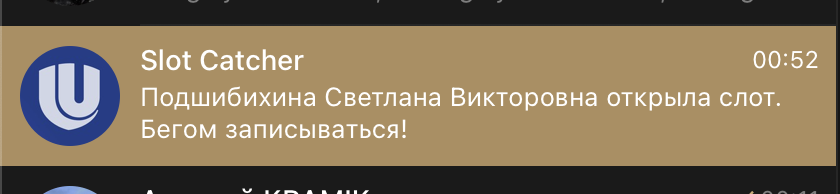

# unn_slot_catcher

Бот для отслеживания свободных слотов к психологам на сайте ННГУ:
https://psys.unn.ru/login

Когда бот находит слот у выбранного психолога, он отправляет уведомление в Telegram.



## Что нужно

- Python 3.12+ и uv
- Google Chrome и chromedriver
- Токен Telegram бота и ID чата с вами

## Установка

1. Склонируйте проект:

```bash
git clone git@github.com:volvetcode/unn_slot_catcher.git
cd unn_slot_catcher
```

2. Установите `uv`, если он еще не установлен:

```bash
curl -LsSf https://astral.sh/uv/install.sh | sh
```

3. Скачайте ChromeDriver под вашу версию Chrome:
https://googlechromelabs.github.io/chrome-for-testing/

4. Положите бинарник ChromeDriver в папку `drivers/`:

```bash
mkdir -p drivers logs
```

Ожидаемый путь по умолчанию:

```text
drivers/chromedriver
```

5. Создайте `.env` на основе `dotenv_example.txt`:

```bash
cp dotenv_example.txt .env
```

6. Заполните обязательные значения в `.env`:

```env
LOGIN=your_unn_login
PASSWORD=your_unn_password

TELEGRAM_TOKEN=your_telegram_bot_token
CHAT_ID=your_telegram_chat_id
```

Остальные настройки уже есть в `dotenv_example.txt`. Самые важные:

- `IS_PROD=TRUE` запускает Chrome в headless-режиме.
- `CHROMEDRIVER_PATH=drivers/chromedriver` задает путь до ChromeDriver.
- `DURATION_HOURS=8` задает время работы бота.
- `PSYCHOLOGISTS=[...]` задает список психологов. Сейчас бот проверяет первого психолога из списка.

## Запуск

```bash
uv run python src/app.py
```

Логи пишутся в формате JSON в папку `logs/`.
